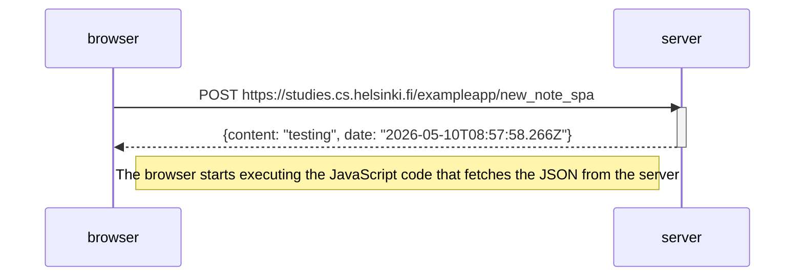

```mermaid
sequenceDiagram
    participant browser
    participant server

    browser->>server: POST https://studies.cs.helsinki.fi/exampleapp/new_note_spa
    activate server
    server-->>browser: {content: "testing", date: "2026-05-10T08:57:58.266Z"}
    deactivate server

    Note right of browser: The browser starts executing the JavaScript code that fetches the JSON from the server
```